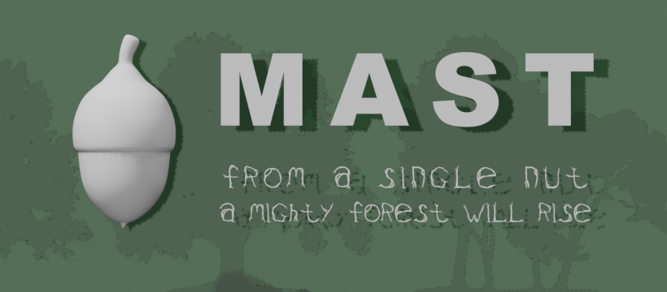

# What is Mast 

MAST (Multiple Agent Story Telling) is for writing in a narrative flow that tells a 'story'. The multiple agents of a MAST story (players, non-player characters, etc.) each have their own story and those stories can have multiple side plots.

Stories have a forward moving flow; there is a beginning, a middle and an end. MAST's programming flow keeps the story moving forward. MAST also facilitates an interactive narrative which allows for choice and branching of the story, revisiting aspects of the story etc. while still flowing the story on a single path.

In MAST for Artemis Cosmos, the multiple agents are the player consoles, the ships, various characters that can be on ships, etc. Artemis Cosmos has the ability to add many more characters to the game. For example there can be multiple characters on a space station that you may interact with. The Damage Control teams can have richer stories and each can be unique.

MAST provides and new simple programming language that enables:

* Language that flows more like a narrative or film script
* Easy and rich GUIs for the pause scene and the Artemis Cosmos consoles
* A Task/State driven system managing multiple tasks in parallel e.g. a quest with side quests
* Behavior tree for complex AI and Dialogs
* Similar capabilities to Visual Novel systems, such as RenPy, Inkle Ink, and Choice script