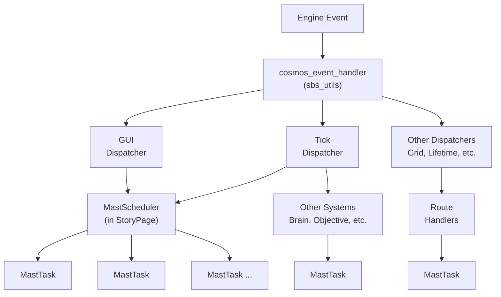

# {{ab.m}} Runtime

## Overview

The Python environment in {{ab.ac}} is single-threaded and runs only on the server. It must handle all engine activities, including the main server logic, client logic, and engine state changes.

The {{ab.m}} runtime creates a pseudo multi-process, pseudo multi-threaded system within this single Python thread.

{{ab.m}} is built on top of **sbs_utils**, a lower-level Python system that receives events from the {{ab.ac}} engine and routes them to a set of **Dispatcher** systems. For more detail, refer to [sbs_utils](../sbs_utils/index.md).

---

## Schedulers and Tasks

The {{ab.m}} runtime runs a number of **Schedulers**. A Scheduler acts similarly to a process — there is one for the server and one for each client. Each client Scheduler is created by the client's GUI component, the **StoryPage**.

Schedulers are responsible for running **Tasks** for their respective client. Tasks are pseudo-threads: they do not run in parallel and are executed one at a time.

When events arrive from the engine, sbs_utils handles them and passes them to the appropriate Dispatcher. Several dispatchers can trigger tasks, which are handled via routes within {{ab.m}}. Ultimately, the StoryPage's Scheduler is *ticked*, which in turn ticks all of its Tasks. For a given event, Schedulers are ticked multiple times to allow the system to fully respond to changes produced by running Tasks.




A Task runs until it completes, or until it returns a **PollResult** that pauses execution — resuming from that point the next time the Task is ticked.

---

## Task Scheduling


Tasks can be scheduled using the functions in the [execution module](../api/procedural/execution.md):

- [**`task_schedule`**](../api/procedural/execution.md#sbs_utils.procedural.execution.task_schedule) — Schedules a new Task on the same Scheduler as the currently running Task.
- [**`task_schedule_client`**](../api/procedural/execution.md#sbs_utils.procedural.execution.task_schedule_client) — Schedules a new Task on the client Scheduler associated with the client ID in the incoming engine event.
- [**`task_schedule_server`**](../api/procedural/execution.md#sbs_utils.procedural.execution.task_schedule_server) — Schedules a new Task on the server Scheduler (client ID = 0).

### Tasks Without a Scheduler

Some Tasks run outside of a Scheduler. Tasks used internally by Brains, Objectives, Prefabs, and similar systems are examples. These Tasks are run on demand and are expected to complete synchronously.

---

## Task Scheduling Mechanics

### How Ticking Works

The runtime processes engine events by ticking all active Schedulers. Each Scheduler in turn ticks all of its Tasks. Schedulers are ticked multiple times per event to allow chains of state changes to fully resolve within a single event cycle.

A Task is ticked by executing its current node. The node returns a **PollResult** that tells the Scheduler what to do next with that Task.

---

### PollResults

Every Task node returns a `PollResults` value when executed. This controls how the Scheduler advances — or pauses — the Task.

| PollResult | Value | Behavior |
|---|---|---|
| `OK_JUMP` | 1 | Jumps execution to a named **Label** elsewhere in the script. The Task continues from that label on the next tick. |
| `OK_ADVANCE_TRUE` | 2 | Advances to the node but indicates success. |
| `OK_ADVANCE_FALSE` | 3 | Advances to the node but indicates failure. |
| `OK_RUN_AGAIN` | 4 | Pauses the Task, keeping the pointer on the **current node**. The same node is retried on the next tick. Useful for polling until a condition is met. |
| `OK_YIELD` | 5 | Pauses the Task, but advances the pointer to the **next node**. That next node executes on the following tick. |
| `OK_END` / `OK_SUCCESS` | 99 | The Task completed **successfully** and is removed from the Scheduler. |
| `FAIL_END` / `BT_FAIL` | 100 | The Task **failed** and is removed from the Scheduler. |
| `OK_IDLE` | 999 | The Task has nothing to do. The Scheduler pauses it until it is explicitly reactivated. |

> The aliases `BT_SUCCESS` and `BT_FAIL` are naming conventions for Tasks used as **Behavior Tree** nodes, where success/failure semantics are meaningful to the tree structure.

---

### Task Lifecycle

```
Scheduled → Running → [Paused] → Running → Completed
                          ↑            |
                     (ticked)    (OK_IDLE reactivated)
```

1. **Scheduled** — A Task is created and added to a Scheduler via one of the `task_schedule` functions.
2. **Running** — The Scheduler ticks the Task, executing its current node and acting on the returned PollResult.
3. **Paused** — A result of `OK_RUN_AGAIN` or `OK_YIELD` pauses the Task in place. `OK_IDLE` pauses it indefinitely until reactivated externally.
4. **Completed** — A result of `OK_END`/`OK_SUCCESS` or `FAIL_END` removes the Task from the Scheduler.

---

### Choosing Between OK_RUN_AGAIN and OK_YIELD

These two results can look similar but serve different purposes:

- Use **`OK_RUN_AGAIN`** when the current node needs to keep retrying — for example, waiting on an external condition before it can proceed. The node re-executes each tick until it is ready to return a different result.
- Use **`OK_YIELD`** when the current node is done with its work but wants to give other Tasks a chance to run before execution continues. The pointer advances, so the *next* node runs on the following tick.

---

## Task Variable Scopes

{{ab.m}} variables can have four scopes: **Shared**, **Client**, **Task**, and **Temporary**.

- **Shared** — Accessible from any Task. All Tasks reference the same value.
- **Client** — Scoped to a specific client.
- **Task** — Scoped to an individual Task.
- **Temporary** — Used for loop variables and data passed to a sub-task.

Shared data, Schedulers, and Tasks are all **Agents**. As Agents, they have an **Inventory** — the collection of variables they hold. *(Note: Scheduler-scoped data is currently managed internally and cannot be assigned directly via {{ab.m}}.)*

### Inherited Variables

By default, Tasks scheduled via a `task_schedule` function start with a **copy** of the Inventory from the scheduling Task. Changes to these variables affect only the copy, not the original.

> This was historically the only scheduling behavior. It does carry extra memory overhead and should be used sparingly.

### Non-Inherited Variables

The `task_schedule` functions accept an optional argument to control inheritance. Setting it to `False` starts the new Task with an empty Inventory. Any data explicitly passed to the Task will be added as Task-scoped variables.

### Sub-Tasks (Shared Variables)

Sub-tasks share the Inventory of the Task that scheduled them — more specifically, the nearest non-sub-task ancestor, referred to as the **root task**.

Any data passed directly to a sub-task becomes variables unique to that sub-task. All other variables belong to the root task's Inventory.

---

## {{ab.m}} startup

In {{ab.m}}, a **Page** refers to a GUI Page. The StoryPage is the concrete implementation of a Page. The StoryPage is always the same page instance, using a layout system with a swapping mechanism triggered by `await gui()`.

The server and each client have their own StoryPage. When a StoryPage is initialized it:

1. Loads and compiles a MAST script file. The compilation is performed once by the server and the result is reused by all clients.
2. Starts the Scheduler and main GUI Task for that client.
3. Runs all top-level code in the script; the code before any labels. Note that Shared-scoped values are only initialized once, regardless of how many clients run the script.
4. Jumps to the labels assigned via the reroute functions.

When in the top-level area of the script, `gui_reroute_server()` and `gui_reroute_clients()` set the starting labels for the server and clients respectively. This tells each Scheduler where to begin execution. For example:

```python
gui_reroute_server("start_server")
gui_reroute_clients("client_main")
```

This pattern is used in `server_console.mast` to direct the server and all clients to their respective entry points when the StoryPage initializes.