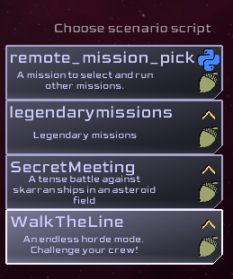

This tutorial is intended to create a small mission in {{ab.ac}}. It will describe the folder structure and files required to create the mission. The tutorial leverages the [sbs_utils](https://github.com/artemis-sbs/sbs_utils) library and the {{ab.m}} scripting language.

The map created will result in a smaller version of the Siege scenario included as part of the Legendary Missions. It leverages a lot of reusable code provided by add-ons that are created from the Legendary Missions files that ship with the game.

## Mission structure

Missions in {{ab.ac}} are not just a single file. It takes several files. {{ab.m}} further adds a couple more files. {{ab.m}} scripts can be written once the file structure is in place.

### Mission required files

A mission script requires 

- script.py
- description.txt

The description.txt file holds information for displaying scenario select list. Which contains:

- A category for the mission. When this list grows, future versions will display or filter based on category. It is not used now.
- The description of the mission.
- a list of up to 6 icons and their color. {{ab.m}} missions for example show an acorn icon.



The script.py file is how the {{ab.ac}} engine communicates with the scripting system.
The engine calls the function cosmos_event_handler with engine events.

=== ":simple-python: python"

    ``` python
    def  cosmos_event_handler(sim, event):
        pass
    ```

Script writers can write there own entire from scratch python missions this way.

Libraries like sbs_utils should help by providing reusable code to build off of.

sbs_utils can be used without {{ab.m}} and provides many low level systems to do so.

### {{ab.m}} Required files

A {{ab.m}} mission script requires a couple more files.

- description (like above)
- script.py (A specific common boilerplate version)
- story.mast
- story.json

It is recommended to start with the [script.py](https://github.com/artemis-sbs/LegendaryMissions/blob/main/script.py) from another {{ab.m}} mission like the one linked.

It provides all the code needed to load the sbs_utils library, provide a default cosmos_event_handler, and bootstraps the {{ab.m}} runtime by running story.mast. It also provides a top level exception handler which helps prevent bugs from crashing the application from python and {{ab.m}} errors.

story.mast can be were your mission script is written. Later in this tutorial it is recommended to create a folder to hold most of mission script code.

story.json specifies the libraries and addons the mission is dependent on. Missions written using {{ab.m}} require at least the sbs_utils library. Many missions will also use items from the core add-ons created by Legendary Missions.

A mission can copy the Secret Meeting [story.json](https://github.com/artemis-sbs/SecretMeeting/blob/main/story.json) as a good start. 

The script.py will likely not need any changes and is used to bootstrap the {{ab.m}} runtime.

### Creating a map
Missions need content. The library and addons work together to present maps to pick from. Maps are discovered at runtime by finding a map label.

A map label starts with "@map" followed by an identifier e.g. first map. A map label is similar to other route labels and the use the "/" separator to distinguish parts of the identity of the label.

The map label also includes a string Display Name. The display name is what is seen by the crew on the mission selections screen.

The label can also have a number of description lines. Each starts with a quote followed by text.
Each line starts with a quote, and there is no ending quote.

=== ":mast-icon: {{ab.m}}"
    
    ```
    @map/first_map "Hello Cosmos"
    " This is my first map
    " and it's description
    ```


### {{ab.m}} Optional files

- README.md
- setup.json

README.md should describe the mission. Missions that are put on github will have the README.md display on the github repository.

??? info "Github is a place to manage source code"
    Github is used by many software developers. {{ab.ac}} has features to get missions from github with a simple command line. Using github is encouraged for it version control abilities and providing a simple single place for downloadable content for the game: Missions, Libraries, Addons and mods.


### Finished step one: First Map

Running this code should result in seeing the mission "Hello Cosmos" when the missions is selected.


The finished code for this step is here:

[code](https://github.com/artemis-sbs/mast_tutorial/tree/step-01)


## Creating a module within a mission

Missions can become complex. Putting all code in story.mast is not the best method for larger projects.

On startup, the {{ab.m}} runtime will run story.mast then it will look for modules and load them. A module is a folder with a \__init__.mast file and any other .mast or .py files. To be included, the files need to be imported by placing an import command in \__init__.mast.


See the [example folder](https://github.com/artemis-sbs/SecretMeeting/tree/main/SecretMaps) in the Secret Meeting mission.

Create a module for the mission.

- Create a folder in the mission folder called maps
- create an \__init__.mast file
- create one or more {{ab.m}} files or python files in the folder
- move the code from story.mast to map.mast in the module folder maps
- add an import statement 

### \___import___.mast
=== ":mast-icon: {{ab.m}}"

    ```
    import map.mast
    ```

### map.mast
=== ":mast-icon: {{ab.m}}"

    ```
    @map/first_map "Hello Cosmos"
    " This is my first map
    " and it's description
    ```

story.mast should now be empty, but keep it for later since the system expects it to exist. It can also be used for code in the future.


### Fished step two: Modular map

The finished code for this step is here:

[code](https://github.com/artemis-sbs/mast_tutorial/tree/step-02)


## Multiple maps and a mission overview

Multiple map labels can be created. Each of these will be discovered and presented as option in the mission selection carousel.

Additionally, the mission overview text (the title and description at the top of the selections screen) can be set using a specific __overview_ map label.

=== ":mast-icon: {{ab.m}}"
    
    ```
    @map/__overview__ "My episodic mission"
    " This is an epic journey 
    " told over several episodes
    ```
### run the mission
Running the mission should now show the overview as well as the first map.


### Fished step two: Modular map

The finished code for this step is here:

[code](https://github.com/artemis-sbs/mast_tutorial/tree/step-03)


## Modules / Addon / Library Files
The map folder created to hold the maps is called a module. Multiple modules can be created in folders in the mission. 

Module folders can have folders however the content of those sub folders are not 'discovered' by the system. Files in those sub folders would need to be imported via the module \__init__.mast

A module can be used to create an __addon__. Addons are simply zip files of a module folder typically renaming the extension from ".zip" to ".mastlib". 

The \__lib__ folder in the {{ab.ac}} missions folder contains the several modules from LegendryMissions as addons.
These addons are created using the build_addons.bat and build_addons.py.

The \__lib__ folder can also contain python libraries. Files with the ".sbslib" extension are python libraries. These are also simply zip files of python modules. While python has several methods for managing libraries, this sbslib method was picked for an {{ab.ac}} simplified method for sharing code.

Addons and libraries are not discoverd by the system. The dependency on a library or addon must be listed in the  [story.json](https://github.com/artemis-sbs/SecretMeeting/blob/main/story.json) file.

There are two sections one for. sbslib files and one for mastlib files. Note that the file name is included so you can use any extension you wish. e.g. use ".zip" when creating and testing your own addons.

Addons present an interesting ways to share partial missions, Gamemaster/Admiral comm commands etc.

The libraries and addons that ship with {{ab.ac}} have a specific naming scheme that include their github user name, github repository name and a version number. This naming can help avoid naming conflicts and version mismatches.


## Adding some map content

To fill out the map, station and NPC ships need to be spawned.
This can be done individually with some low level functions. This tutorial will use a couple of python functions defined in the addons.

To spawn at a lower level see the [spawn](../api/procedural/spawn.md) module.

### Creating some stations

To create a spread of stations, use the terrain_spawn_stations, passing it the difficulty level and the lethal terrain value. The higher the difficulty, the fewer stations that will spawn. The lethal terrain value tells the function how many mines to generate around the station.

=== ":mast-icon: {{ab.m}}"

    ```
    terrain_spawn_stations(5, 2)
    ```

### Handle the player ships
The following task schedules a {{ab.m}} label that handles spawning the player ships.

=== ":mast-icon: {{ab.m}}"

    ```
    await task_schedule(spawn_players)
    ```


### Creating some enemies

The create_siege_fleet function. This function takes a race for the fleet to spawn. The difficult level 0 - 10.
and a position. This example picks random points in a ring around 0,0,0. 

=== ":mast-icon: {{ab.m}}"

    ```
    for a in range(10):
        fleet_pos = Vec3.rand_in_sphere(39990, 40000, False, True)
        create_siege_fleet("Kralien", 5, fleet_pos.x, fleet_pos.y, fleet_pos.z)
    ```

### End game conditions

Script writers can create their own end game logic or use the Admiral (Game Master) console. The Admiral has a command to end the game.


The [default end game logic](https://github.com/artemis-sbs/LegendaryMissions/blob/main/maps/watch_for_end.mast) for Legendary Missions watches for failure when all stations or players are destroyed, and victory if all enemies are defeated. It will also end the game if the mission timer runs out. Explaining this code goes beyond the intent of a simple tutorial like this.

The code is not in an add-on, so it needs to be copied.

To have an end game like this:

- copy the watch_for_end.mast file to this tutorial mission map module.
- Add an __import watch_for_end.mast__ to \__init__.mast
- add a task_schedule to run the logic

=== ":mast-icon: {{ab.m}}"

    ```
    task_schedule(task_end_game)
    ```

??? Note "Taunts may not work"

    At this time taunts will not work unless the taunt.json file is in the mission. The taunt.json can be copied from Legendary Missions.
    This will be addressed in a future update.


### Finish: Step four simple game

This ends this "getting started" tutorial. Running the script should be a playable game fighting of some enemy fleets.

The finished code for this step is here:

[code](https://github.com/artemis-sbs/mast_tutorial/tree/step-04)

## More complex examples

The Legendary Mission, Secret Meeting and the WalkTheLine have their own maps and are a good reference.

- [Legendary Mission maps](https://github.com/artemis-sbs/LegendaryMissions/blob/main/maps)
- [Legendary Mission Admiral Comms](https://github.com/artemis-sbs/LegendaryMissions/blob/main/zadmiral/admiral_comms.mast)
- [Secret Meeting map](https://github.com/artemis-sbs/SecretMeeting/tree/main/SecretMaps)
- [Walk The Line map](https://github.com/artemis-sbs/WalkTheLine/tree/main/WalkLine)


