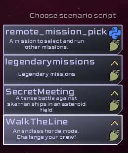
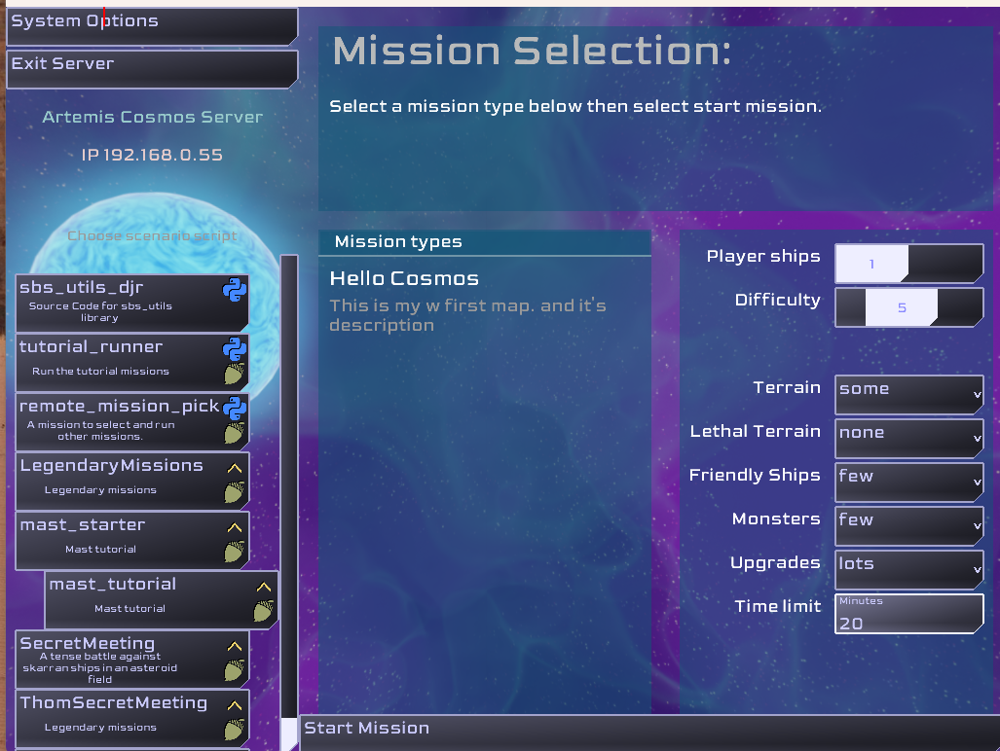
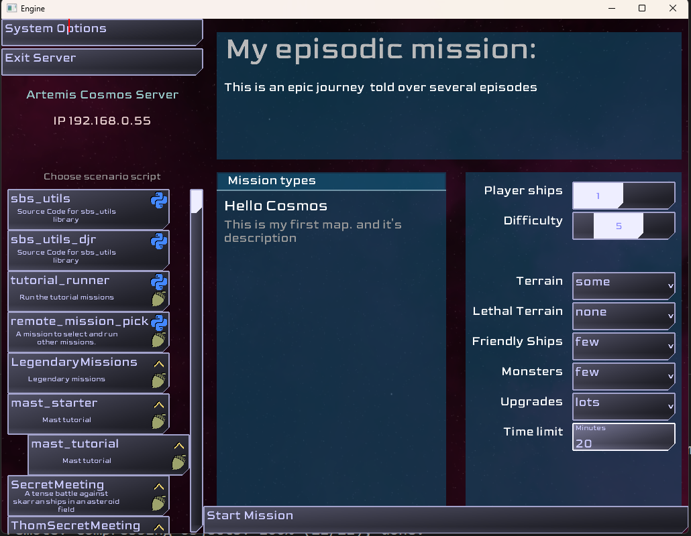

This tutorial builds a small mission for {{ab.ac}}. It walks through the folder
structure and files a mission needs, then adds content step by step. It uses the
[sbs_utils](https://github.com/artemis-sbs/sbs_utils) library and the {{ab.m}}
scripting language.

The result is a smaller version of the Siege scenario from Legendary Missions. It
reuses a lot of code from the add-ons that ship with the game.

## Mission structure

A mission in {{ab.ac}} is a folder, not a single file &mdash; it takes several
files, and {{ab.m}} adds a couple more. Once the file structure is in place you can
start writing {{ab.m}} scripts.

### Required files

At minimum, a mission needs:

- `script.py`
- `description.yaml`

`description.yaml` provides the information shown in the mission select list:

```yaml
format version: 1
Category: Standard
Visible Mission Name: My Mission Name
Description: A short description of the mission.
```

> Older missions used `description.txt` (still supported). New missions should use
> `description.yaml`.



`script.py` is how the {{ab.ac}} engine talks to the scripting system: the engine
calls `cosmos_event_handler` with each engine event.

=== ":simple-python: python"

    ``` python
    def cosmos_event_handler(sim, event):
        pass
    ```

You *can* write an entire mission in Python this way &mdash; but that means
handling every engine event yourself. Libraries like sbs_utils provide reusable
systems so you can focus on the mission instead. (sbs_utils can be used without
{{ab.m}}, and provides plenty of lower-level systems if you prefer Python.)

### Files a {{ab.m}} mission adds

A {{ab.m}} mission needs a couple more files:

- `description.yaml` (as above)
- `script.py` (a small, standard boilerplate version)
- `story.mast` &mdash; your mission script
- `story.json` &mdash; the libraries and add-ons the mission depends on

Start from an existing mission's
[script.py](https://github.com/artemis-sbs/LegendaryMissions/blob/main/script.py).
It loads sbs_utils, provides a default `cosmos_event_handler`, bootstraps the
{{ab.m}} runtime by running `story.mast`, and installs a top-level exception
handler so a script error doesn't crash the game. You won't usually need to change
it.

`story.mast` is where your mission script lives. (Later we'll move most of the
code into its own folder.)

`story.json` lists the libraries and add-ons the mission depends on. Every {{ab.m}}
mission needs at least sbs_utils; most also use the core add-ons from Legendary
Missions. Copying Secret Meeting's
[story.json](https://github.com/artemis-sbs/SecretMeeting/blob/main/story.json) is
a good start.

### Creating a map

A mission needs content. The library and add-ons present a list of **maps** to
pick from; maps are discovered at runtime by finding a **map label**.

A map label starts with `@map/` followed by an identifier, and (like other route
labels) uses `/` to separate parts of the identifier. It also has a display name
&mdash; the text the crew sees on the selection screen &mdash; and, optionally,
description lines that each start with a `"`:

=== ":mast-icon: {{ab.m}}"

    ```
    @map/first_map "Hello Cosmos"
    " This is my first map
    " and its description
    ```

### Optional files

- `README.md`
- `setup.json`

`README.md` should describe the mission; on GitHub it's shown on the repository
page.

??? info "GitHub is a place to manage source code"
    GitHub is used by many software developers. {{ab.ac}} can fetch missions from
    GitHub with a single command. Using GitHub is encouraged for its version
    control and as a simple home for downloadable content &mdash; missions,
    libraries, add-ons, and mods.

### Finished: step one &mdash; first map

Running this should show the map "Hello Cosmos" in the mission selection screen.



The finished code for this step:
[step-01](https://github.com/artemis-sbs/mast_tutorial/tree/step-01).

## Splitting a mission into modules

Missions grow. Keeping everything in `story.mast` doesn't scale well.

On startup the {{ab.m}} runtime runs `story.mast`, then discovers and loads
**modules**. A module is a folder with an `__init__.mast` file plus any other
`.mast` or `.py` files; a file is included only if `__init__.mast` imports it.
(See the [SecretMaps folder](https://github.com/artemis-sbs/SecretMeeting/tree/main/SecretMaps)
in Secret Meeting.)

Let's move the map into a module:

- create a folder in the mission called `maps`
- add an `__init__.mast` file
- add one or more `.mast` / `.py` files
- move the map code from `story.mast` into `maps/map.mast`
- import it from `__init__.mast`

`maps/__init__.mast`:

=== ":mast-icon: {{ab.m}}"

    ```
    import map.mast
    ```

`maps/map.mast`:

=== ":mast-icon: {{ab.m}}"

    ```
    @map/first_map "Hello Cosmos"
    " This is my first map
    " and its description
    ```

`story.mast` can now be empty, but keep the file &mdash; the system expects it, and
you may add code to it later.

### Finished: step two &mdash; modular map

The finished code for this step:
[step-02](https://github.com/artemis-sbs/mast_tutorial/tree/step-02).

## Multiple maps and a mission overview

You can create several map labels; each is discovered and offered in the mission
selection carousel.

You can also set the mission **overview** (the title and description at the top of
the selection screen) with the special `@map/__overview__` label:

=== ":mast-icon: {{ab.m}}"

    ```
    @map/__overview__ "My episodic mission"
    " This is an epic journey
    " told over several episodes
    ```

Running the mission now shows the overview as well as the first map.



### Finished: step three &mdash; overview

The finished code for this step:
[step-03](https://github.com/artemis-sbs/mast_tutorial/tree/step-03).

## Modules, add-ons, and libraries

The `maps` folder you created is a **module**. A mission can have several modules,
each in its own folder.

A module folder may contain subfolders, but files in subfolders are **not**
discovered automatically &mdash; import them from the module's `__init__.mast`.

A module can be packaged as an **add-on**: a zip of the module folder, with the
extension renamed from `.zip` to `.mastlib`. The `__lib__` folder next to the
{{ab.ac}} missions folder holds the Legendary Missions modules as add-ons.

`__lib__` also holds Python **libraries** &mdash; `.sbslib` files, which are just
zips of Python modules. (Python has its own packaging systems; `.sbslib` is a
simplified scheme chosen for sharing code in {{ab.ac}}.)

Add-ons and libraries are **not** discovered automatically. List each dependency in
[story.json](https://github.com/artemis-sbs/SecretMeeting/blob/main/story.json),
which has a section for `sbslib` files and one for `mastlib` files. The full file
name (including extension) is listed, so you can use any extension &mdash; e.g.
`.zip` while developing and testing your own add-on.

Add-ons are a handy way to share partial missions &mdash; Gamemaster/Admiral comm
commands, for example.

The libraries and add-ons that ship with {{ab.ac}} follow a naming scheme that
includes the GitHub user, repository name, and a version, which helps avoid name
clashes and version mismatches.

## Adding map content

To fill out the map, spawn stations and NPC ships. You can do this with low-level
functions (see the [spawn](../api/procedural/spawn.md) module), but this tutorial
uses a few helper functions from the add-ons.

### Stations

`terrain_spawn_stations` spreads stations across the map. Pass the `DIFFICULTY`
level and a lethal-terrain value: higher difficulty spawns fewer stations, and the
lethal-terrain value controls how many mines surround each station.

=== ":mast-icon: {{ab.m}}"

    ```
    terrain_spawn_stations(5, 2)
    ```

### Player ships

Schedule the add-on label that spawns and positions the player ships, and wait for
it to finish:

=== ":mast-icon: {{ab.m}}"

    ```
    await task_schedule(spawn_players)
    ```

### Enemies

`prefab_spawn` creates one or more objects from a prefab label.
`prefab_fleet_raider` builds an enemy fleet; pass a race, a difficulty (0&ndash;10),
and a position. This spawns ten fleets at random points on a ring around the
origin:

=== ":mast-icon: {{ab.m}}"

    ```
    for a in range(10):
        fleet_pos = Vec3.rand_in_sphere(39990, 40000, False, True)
        prefab_spawn(prefab_fleet_raider, {
            "race": "skaraan",
            "fleet_difficulty": DIFFICULTY,
            "START_X": fleet_pos.x,
            "START_Y": fleet_pos.y,
            "START_Z": fleet_pos.z,
        })
    ```

### End-game conditions

The simplest way to define win/lose conditions is `game_end_condition_add`: pass a
promise, a result message, and `True` for a win or `False` for a loss. Conditions
are checked every tick, and the first one that becomes true ends the game.

=== ":mast-icon: {{ab.m}}"

    ```
    # Lose if all players are destroyed
    game_end_condition_add(destroyed_all(role("__player__")), "All ships lost.", False)
    # Lose if all stations are destroyed
    game_end_condition_add(destroyed_all(role("station")), "Station destroyed.", False)
    # Win if all enemies are destroyed
    game_end_condition_add(destroyed_all(role("raider")), "Victory! All enemies defeated.", True)
    ```

> `destroyed_all`, `destroyed_any`, `distance_less`, and `distance_point_less`
> return promise objects suitable for `game_end_condition_add`. `is_timer_finished`
> returns a plain bool and can't be used here.

For a fuller implementation with a mission timer and taunts, see the
[default end-game logic](https://github.com/artemis-sbs/LegendaryMissions/blob/main/maps/watch_for_end.mast)
in Legendary Missions. It isn't packaged as an add-on, so copy it into your mission
module.

??? note "Taunts may not work"
    Taunts currently require a `taunt.json` file in the mission; copy it from
    Legendary Missions. This will be addressed in a future update.

### Finished: step four &mdash; a simple game

That wraps up the getting-started tutorial &mdash; running the script should give
you a playable game fighting off enemy fleets.

The finished code for this step:
[step-04](https://github.com/artemis-sbs/mast_tutorial/tree/step-04).

## More complete examples

Legendary Missions, Secret Meeting, and WalkTheLine have their own maps and make
good references:

- [Legendary Missions maps](https://github.com/artemis-sbs/LegendaryMissions/blob/main/maps)
- [Legendary Missions Gamemaster comms](https://github.com/artemis-sbs/LegendaryMissions/blob/main/gamemaster_comms)
- [Secret Meeting](https://github.com/artemis-sbs/SecretMeeting/tree/main/story.mast)
- [WalkTheLine](https://github.com/artemis-sbs/WalkTheLine/tree/main/story.mast)
