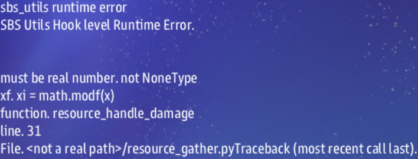

# MAST Tutorial
A tutorial describing how to write a simple mission that utilizes many of the tools MAST has to offer.
## Tutorial Goals
### General Goals
Upon completion of this tutorial, you will have learned to:
1. [Create a new mission from a template](#1-setting-up-your-first-mission)
2. [Update the name and description of your mission](#2-whats-in-a-name)
3. [Understand what a 'label' is in MAST](#3-a-brief-overview-of-labels)
4. [Spawn player ships](#4-spawning-player-ships)
5. [Mission settings](#5-mission-settings)
6. [Spawn terrain](#6-spawning-terrain)
7. [Spawn enemies](#7-spawning-enemies)
8. [Utilize Roles](#8-utilizing-roles)
9. [Add science scans](#9-science)
10. [Detect damage and destruction](#10-damage-and-destruction)
11. [Recurring Tasks](#11-recurring-tasks)
12. [Build comms buttons]

### Specific Goals
For this tutorial, we are writing a mission about finding and recovering a lost treasure.  

1.  The players will need to fight off scavengers while they search.  
2.  They will need to scan asteroids to find the treasure.  
3.  They will need to shoot at the asteroid to remove debris from the treasure.  
4.  They will need to collect the treasure by giving instructions to a specialist team retrieve it.

### What you will NOT learn
MAST is loosely based on, and for Cosmos is compiled by, Python. Python is a popular programming language which integrates with the Cosmos game engine to allow for flexible mission scripting. This tutorial is not a python tutorial, and we will touch on some aspects of the language, but if you want a more thorough understanding of python there are loads of resources online.

## 1. Setting up your first mission

### Download mast_starter
To download the basic template documents for any mission, start with the mast_starter mission from the [mast_starter Github Repository](https://github.com/artemis-sbs/mast_starter)


For a mission that already has some very basic functionality included, you could also use [Secret Meeting](https://github.com/artemis-sbs/SecretMeeting). This mission is packaged with Cosmos by default, but there may be an updated version on GitHub, and it is always recommended that the most recent version be used.

For this tutorial, we will assume that you are using mast_starter as a template.  


## 2. What's in a name?
The name of your mission is, of course, a pretty important part of the mission.  
Fortunately, it's easy to set the name and description of the mission.  
Name the mission folder to reflect the name you've chosen for your mission. We will be calling our mission "Treasure Hunt".  
Now, open `description.txt` in your mission folder. There are at least three lines in this text file.
You will see something like this:
```
Standard
Mast Mission Template
116 #F0D56E 
147 #9da36c
```
The first line is the name of your mission, as it appears in the mission selection button.  
The second line is the mission's description, as it appears in the mission selection button.  
The third line and onwards describe icons that appear on the mission selection button.  
The number at the start of the line is one of the icons from `grid_icon_sheet.png`, located in the `/data/graphics/` folder of the artemis cosmos directory. From left to right, top to bottom, the icon's number increments from 1 onwards. 
The second set of seemingly random characters is a hexidecimal color code. You can find hex codes online easily.

Once you've changed these to fit what you want, we can close `description.txt` and open `story.mast` instead:
```python
# Use for startup logic
@map/first_map "Hello Cosmos"
" This is my first map.
```
`story.mast` is where the bulk of your mission will eventually go, but right now, we're only concerned with the line that starts with `@map`.  
A line starting with `@map` defines a label, which we will get into more later. It tells the game that this is a mission, and what its name is.
In our case we want to change the name of the map from "Hello Cosmos" to our chosen mission name - "Treasure Hunt". Note that this is displayed separately from the information in `description.txt`. The name and description in `information.txt` are displayed on the button to select the mission. The name and description shown in the UI after selecting the mission are defined here in `story.mast`.  
The `/first_map` part of the label is used internally by the MAST interpreter, but isn't relevant to us at the moment. You may choose to change this to whatever you want, but it cannot have spaces or special characters in it.  
The line following the label definition is the label description:
```python
" This is my first map.
```
This line, and any subsequent lines that begin with a double quote, comprise the description.
For our example I am replace the existing description with this:
```python
" Find the treasure, if you can! Many have sought this long-lost piece of history.
" None have succeeded. Some say it is only a myth. But recent archaeological finds have
" given clues regarding the location of this mysterious artifact.
```
Now if you open Cosmos and select the Treasure Hunt mission, you will see the mission title and description.  

## 3. A brief overview of Labels
A label, at its most basic, is a _reusable_ and _schedulable_ section of code. A label is used by MAST to create at task, and that task can be scheduled to run at a particular time, under specific conditions, and more than once, if desired. This gives mission writers a great deal of flexibility.  
### Label Types
There are multiple kinds of labels:  
* Media Labels  
* Map Labels  
* Route Labels  
* Main Labels  
* Inline Labels (also known as sublabels)  

We've already encountered a map label - `@map/first_map "Treasure Hunt"` Media labels are very similar in syntax and meaning. They start with `@media`, followed by the type of media, followed by the desired filename or directory. Note that the name at the end, unlike that of a map label, currently has no bearing on the mission.
```
@media/music/default "Cosmos Default Music"
@media/skybox/sky1-bored-alice "borealis"
```
This will set the mission's music and skybox to whichever you specify. If you use more than one, a random skybox or music will be used.
We will cover route labels in later sections, so we will focus now on the last two types of labels.
Main labels (which will hereafter be referred to as just labels) are the mainstay of a mission. Let's dissect the following example:
````python
== Hello_Cosmos
" This is an example label
metadata: ```
some_data: 10
```
````
The first line defines a label's name. A label has two or more equals signs at the start of the line. It may have any number of spaces, followed by the name of the label. The name may contain any number, letter, or underscore, but may not begin with a number. It may then be followed by any number of spaces, and any number of equals signs at the end.
All of the following are valid label definitions, with the same name:
```
== Hello_Cosmos
======Hello_Cosmos==
===               Hello_Cosmos                 ==========
```
Though do note that labels must have unique names, so if you tried to include the above exactly, it would cause errors.   
Sublabels have the same rules, but use a minus sign:
```
---- some_sublabel
```
The second line in our label example above you will recognize from the map labels - it is a description of the label. This is mostly used for documentation purposes, so that you (and any mission writer who might be trying to learn from your mission) can more easily follow the intent and use of the label.  
The third line and onwards defines the metadata associated with this label. Within the set of triple backticks, you can define keys, and set the default value for that key. This is very useful, because when you schedule a task, you can include different values for each key. This allows a label to not only run multiple times, but use different information while doing so.
For both main and sublabels, the description and metadata lines are optional.  
You might be able to guess what is special about sublabels. They are defined inside of a main label, and are only applicable to the their parent label. Sublabels with the same parent may not share a name, but if their parent labels are different, sublabel names can be reused.

## 4. Spawning Player Ships
Moving on from all that technical stuff, let's get into actual mission writing! … Which requires some technical stuff.  
You've learned that labels are used by MAST to create a task. Well, it turns out that it's time to do so.
```python
await task_schedule(spawn_players)
```
Wait, is it that simple? Yeah, it really is! But what does all this do? What does it mean?
Let's start with `task_schedule(spawn_players)`. `task_schedule()` is a python function (if you're not sure what a function is, do a google search). It takes a label as an argument, and builds a task from that label. "But, wait!" I hear you interrupt. "Where is `spawn_players` defined? And how do I learn all of these functions and what they do?"
That's a couple of great questions. First, let's take a brief detour and open `story.json` in your mission folder. You'll see something like this:
```json
{
    "sbslib": [
        "artemis-sbs.sbs_utils.v1.0.4.sbslib"
    ],
    "mastlib": [
        "artemis-sbs.LegendaryMissions.autoplay.v1.0.4.mastlib",
        "artemis-sbs.LegendaryMissions.ai.v1.0.4.mastlib",
        "artemis-sbs.LegendaryMissions.commerce.v1.0.4.mastlib",
        "artemis-sbs.LegendaryMissions.comms.v1.0.4.mastlib",
        "artemis-sbs.LegendaryMissions.consoles.v1.0.4.mastlib",
        "artemis-sbs.LegendaryMissions.damage.v1.0.4.mastlib",
        "artemis-sbs.LegendaryMissions.docking.v1.0.4.mastlib",
        "artemis-sbs.LegendaryMissions.fleets.v1.0.4.mastlib",
        "artemis-sbs.LegendaryMissions.grid_comms.v1.0.4.mastlib",
        "artemis-sbs.LegendaryMissions.hangar.v1.0.4.mastlib",
        "artemis-sbs.LegendaryMissions.internal_comms.v1.0.4.mastlib",
        "artemis-sbs.LegendaryMissions.operator.v1.0.4.mastlib",
        "artemis-sbs.LegendaryMissions.science_scans.v1.0.4.mastlib",
        "artemis-sbs.LegendaryMissions.side_missions.v1.0.4.mastlib",
        "artemis-sbs.LegendaryMissions.upgrades.v1.0.4.mastlib",
        "artemis-sbs.LegendaryMissions.zadmiral.v1.0.4.mastlib"
    ]
}
```
The sbslib file listed is the groundwork of MAST and is required for any mission. It's loaded with functions for you to use.
The mastlib files, on the other hand, are entire optional. They contain, in this example, all of the contents of the LegendaryMissions mission folder, and are referred to as "addons". You can remove any of them, but until you've learned more about mission writing you should not. These files contain all the information about the different consoles, enemy and friendly AI, upgrades, and more, and as such they comprise the core of the default Cosmos gameplay experience. However, these are made up of MAST files, including labels that can be utilized by us, as mission writers.  
If you open the `/Cosmos_Install/data/missions/__lib__/` folder, you'll see these .sbslib and .mastlib files. You can copy and rename them to .zip and unzip them to view their contents, or you can go to the [github page](https://github.com/artemis-sbs/LegendaryMissions).
The `spawn_players` label is defined in [LegendaryMissions/fleets/map_common.mast](https://github.com/artemis-sbs/LegendaryMissions/blob/main/fleets/map_common.mast), if you want to take a look at it.  

There's another way to find all these functions, though: if you use [VSCode](https://code.visualstudio.com/) (which I recommend), there's an extension called [MAST](https://marketplace.visualstudio.com/items?itemName=astrolamb.mast) that is built for us mission writers. It has loads of features that you'll find useful.  

But let's get back to our own mission. We've looked at task_schedule(spawn_players), but there's another part of this line that's important. The line begins with `await`. `await` tells MAST to pause the current task (our mission) until the completion of the `spawn_players` task. Without using `await`, the new task would run concurrently with our mission's current task. We want to make sure that the player ships have spawned before we continue with our task, and `await` does this quite handily.

## 5. MIssion Settings

While we're on the topic of player ships, you may have noticed that Legendary Missions have various settings, including a setting for the number of player ships. You have probably wondered how you can add these settings to your mission. Let's dive in!  
Let's look at the beginning of the Double Front mission. In the metadata for the map label, we have the following:
``` yaml
Properties:
  Main:
    Player Ships: 'gui_int_slider("$text:int;low: 1.0;high:8.0;", var= "PLAYER_COUNT")'
    Difficulty: 'gui_int_slider("$text:int;low: 1.0;high:11.0;", var= "DIFFICULTY")'
  Map:
    Terrain: 'gui_drop_down("$text: {TERRAIN_SELECT};list: none, few, some, lots, many",var="TERRAIN_SELECT")'
    Lethal Terrain: 'gui_drop_down("$text: {LETHAL_SELECT};list: none, few, some, lots, many", var="LETHAL_SELECT")'
    Friendly Ships: 'gui_drop_down("$text: {FRIENDLY_SELECT};list: none, few, some, lots, many", var="FRIENDLY_SELECT")'
    Monsters: 'gui_drop_down("$text: {MONSTER_SELECT};list: none, few, some, lots, many", var="MONSTER_SELECT")'
    Upgrades: 'gui_drop_down("$text: {UPGRADE_SELECT};list: none, few, some, lots, many", var= "UPGRADE_SELECT")'
    Time Limit: 'gui_input("desc: Minutes;", var="GAME_TIME_LIMIT")'
```
These are the default properties for all the Legendary Missions, and you can probably figure out most of what is going on here, but let's touch a few important bits.  
There are a bunch of `gui_whatever()` functions that can be used, and they all work very similarly. They need a `$text` attribute and a `var` attribute. `$text` is the text displayed on the gui element. The `var` attribute's value is the name of a variable that can be used by your mission script.  
You'll notice that within `Properties`, there's two sub keys: `Main` and `Map`. You can add more of these if you want, they are collapsible groupings. Within each group, you can add however many settings you desire by adding additional `gui_whatever()` functions, which will most likely be dropdowns and sliders as shown above.

Now how do we use these? Well, as mentioned previously, the `var` attribute in the gui functions tell MAST that the selected value of the gui element is assigned to the specified variable. If we wanted to, we could use the settings like so:
```python
if LETHAL_SELECT == "none":
    mine_count = 0
if LETHAL_SELECT == "few":
    mine_count = 20
if LETHAL_SELECT == "some":
    mine_count = 40
if LETHAL_SELECT == "lots":
    mine_count = 60
if LETHAL_SELECT == "many":
    mine_count = 80
```
In this example, you could then spawn the number of mines based on the player's selection. Legendary Missions uses the `terrain_to_value(LETHAL_SELECT)` function to convert "none", "few", etc to numeric values, which is usually a much more useful form of information for code.
This is probably a good time to note that if a variable is in all caps like `LETHAL_SELECT`, it should only be changed if it *really* needs to be changed. You can define your own variables in all caps as well to identify variables that should not be changed.  

We'll come back and use settings more in later sections.

## 6. Spawning Terrain
So we've got player ships and nothing else on the map right now. Let's add some terrain. For our mission, we want to have an asteroid field. One of these asteroids will contain the treasure. There's a whole slew of ways we could spawn a bunch of randomly placed asteroids. This isn't the place to go through those, so I'll instead refer you to the tutorial on terrain.

There's a very simple way to spawn generic terrain, but without any customization:
```python
# Convert 'some' or whatever to a numeric value
terrain_value = terrain_to_value(TERRAIN_SELECT)
# A function from Legendary Missions that spawns a bunch of asteroids based on the terrain value
terrain_asteroid_clusters(terrain_value)
```
This applies to nebulae and black holes as well, using the applicable functions.

## 7. Spawning Enemies
It wouldn't be an Artemis mission without its core gameplay: combat! We need to add some enemies to our map. Similar to terrain, there's a host of ways to spawn enemies. We'll look at two options for now, and other tutorials will go into more detail on the rest.  
First, we'll look at the `npc_spawn()` function. This can be used to spawn any npc, be it an enemy, a friendly, or a neutral.
`npc_spawn` takes several arguments:
```python
npc_spawn(x,y,z,name,side,art_id,behav_id)
```
`x`, `y`, and `z` are the coordinates at which it should spawn.  
`name` is the name of the ship that is displayed on the UI, e.g. "Artemis" or "D51".
`side` is, as indicated, the side or faction the ship belongs to, such as "tsn" or "kralien". However, it is slightly more complicated than that, but we'll dig into this more in the next section.
`art_id` is used to determine what 3D model, texture, etc., that should apply to the ship. These can be found in shipData.json, and for any given ship, this is the `artfileroot` value.
Finally, `behav_id` tells Cosmos how to handle the ship. Don't worry too much about this, 
As an example:
```python
npc_spawn(300,800,0,"Ravager of Worlds","Torgoth_Leviathan","behav_npc")
```
Using `npc_spawn()` is great for spawning a single ship, especially if it has a particular name and art, or a particular purpose in your story. But if you want to spawn, say, a generic Kralien fleet, it would be a hassle to spawn each ship using `npc_spawn()`.  

Instead, MAST has a 'prefab' system. A prefab is actually just a label, but to use a prefab, we call the `spawn_prefab()` function. Legendary Missions includes several prefabs (and it is likely that more will be added over time), and it has one specifically for enemy fleets (though it isn't limited to spawning enemy enemies) called `prefab_fleet_raider`. I hope at this point you have intuited how to use this function:
```python
prefab_spawn(prefab_fleet_raider)
```
But I can hear you wondering "How is this useful? I can't choose where to put the fleet." It is now time to expand upon the use of labels. Remember how labels can have metadata associated with the label? Whenever you run a label, you can include data to pass to the task. In this case, `prefab_spawn()` has a second argument where you can put that data.
Let's look at the metadata for `spawn_fleet_raider`:
```yaml
type: prefab/fleet/raider
race: kralien
ship_roles: raider
fleet_roles: raider_fleet
fleet_difficulty: 5
brain:
```

The metadata keys `type`, `race`, `ship_roles`, `fleet_roles`, `fleet_difficulty`, and `bran` can all be customized. I've left out the contents of `brain` for brevity, and because AI brains are beyond the scope of this tutorial. What isn't obvious here is that the variables `START_X`, `START_Y`, and `START_Z` can be set for any label, even if it's not relevant. So how do we use this. Let's say we don't need to change any of the values in the metadata except for `fleet_difficulty` and the position coordinates.
```python
prefab_spawn(prefab_fleet_raider, {"fleet_difficulty": DIFFICULTY, "START_X": 1000, "START_Y": 20000, "START_Z": -100})
```
Pretty paiinless, if you ask me. And did you catch how we used the `DIFFICULTY` setting? This can be used for other labels as well, and makes the use of labels very flexible.
Note that the data is effectivley a python [Dictionary](https://www.w3schools.com/python/python_dictionaries.asp), if you want to dig into those more. You might also be wondering more about fleets, how they work, and how they cam be further customized with composition and AI, but again, those topics are beyond the scope of this tutorial.

## 8. Utilizing Roles
In the metadata section above, there were two keys `ship_roles` and `fleet_roles`. The Role system in Cosmos is a powerful and integral part of MAST, and its definitely worth discussing roles in some detail here.  
Every object in the game has roles associated with it, and they can have any number of roles. Some of the default roles are listed in shipData.json. Remember how I said we'd discuss the `side` argument in `npc_spawn()`? Well, it turns out that the side of an object is also a role, but an object can only have one side, as opposed to unlimited roles, and sides determine what shows up in the game as friendly vs enemy vs neutral.  
Now, how do we use roles? There are a few functions that use them. The three you will probably use most often are `role()` `add_role()`, and `has_role()`.  
In my opinion, `role()` is the really fun one. If we call `role("my_role")`, it returns a [Set](https://www.w3schools.com/python/python_sets.asp) containing the IDs of all objects that have the role "my_role". We can use set operations to find specific subgroups in really elegant way. Let's say we want to find all TSN ships that are not carriers:
```python
not_carriers = role("tsn")-role("carrier")
```
 `has_role()` is simple; it returns `True` if the specified object has the role, otherwise it returns `False`:
```python
if has_role(ship, "my_role"):
    # Do something
```
`add_role()` seems similar in use. It adds the role to the object, but does not return anything. 
```python
add_role(ship, "new_role")
```

For our tutorial mission, we want a particular asteroid to contain treasure. We've spawned the asteroids already, but how can we make one of them special? We can start by using `role()`!
```python
asteroids = role("asteroid")
```
We have found all the asteroids, so we need to pick one of them to contain the treasure. MAST has a function that chooses a random id from a set:
```python
random_asteroid = random_id(asteroids)
```
And now that we have an asteroid to contain the treasure, we can make it special:
```python
add_role(random_asteroid, "treasure")
```

Now let's use our newfound knowledge of roles to do....

## 9. Science!
In out tutorial mission, we want our players to be able to find the right asteroid. To do that, the asteroid will have special scan text, so the science officer will need to scan all asteroids until the treasure is found.
First, we need to tell MAST that science should be enabled for objects that meet certain criteria. In our case, the criteria is an object with the "treasure" role:
```python
//enable/science if has_role(SCIENCE_SELECTED_ID, "treasure")
```
This is a route label or a route, and all routes share this format. You'll note that we have a new variable: `SCIENCE_SELECTED_ID`. All routes have similar variables, and they can be found [here](https://artemis-sbs.github.io/sbs_utils/mast/routes/). The big difference between route labels and other types of labels is how and when they run. While main and sublabels are scheduled by the mission writer, routes run whenever the specified conditions are met. In this case, the object represented by `SCIENCE_SELECTED_ID` must have the "treasure" role.  
We have another important step before we begin adding science scans:
```python
//science if has_role(SCIENCE_SELECTED_ID, "treasure")
```
The `//enable/science` route is a necessary flag for MAST that prevents it from using too much computation time. We don't need to know how or why it works in any detail, but it is very important to include for science.
Now, on the scan text area of the science console, there are some buttons: "scan", "status", or "info", for example. Buttons are easily added to scan info using the plus sign, followed by the name, in quotes:
```python
    + "scan"
    + "status"
    + "bio"
```
Adding scan text is just as simple. Let's just use one button for the moment:
```python
    + "scan"
        <scan>
            % This asteroid has some odd radiation readings...
```
And what's really cool is that we can have multiple choices for scan text to use! This can improve immersion and replayability:
```python
    + "scan"
        <scan>
            % This asteroid has some odd radiation readings...
            % Scans of the asteroid show that part of the asteroid is inconsistent with the rest.
            % WHOA! These readings are off the charts!
```
I'm going to add this as well, to guide the players towards shooting the asteroid:
```python
    + "status":
        <scan># Give a hint as to how to access the treasure
            % The asteroid has a dense core, surrounded by large quantities of normal asteroid material. Maybe we can blast some of it away...
```
Go ahead and add at least one more button with some more scan information to your own. This is a good time to remind you, if you haven't noticed it out already, that python and MAST, use indentation to designate blocks of code. Note that the button, scan, and scan text sections are seqeuentially indented. All of these scan buttons should have the same indentation.

## 10. Damage and Destruction
In the last section, we learned about route labels. Remember how I said that routes run whenever the conditions are met? Well, there's routes for damage - several, in fact. Here's the list of damage routes:
```python
# When an object is destroyed
//damage/destroy
# When damage is taken due to overheating
//damage/heat
# When an engineering node takes damage (aside from heat)
//damage/internal
# Documentation is unclear on this, but I think it's when a crew member (DamCon) is killed
//damage/killed
# Object took damage that doesn't meet the other criteria
//damage/object
```
We want the players for our mission to shoot at the asteroid, and to detect when that happens, we'll use the `//damage/object` route. Once it's been hit, we're going to get rid of the asteroid and replace it with the treasure.
```python
//damage/object if has_role("treasure")
    sbs.delete_object(DAMAGE_TARGET_ID)
```
This is the first time we've encountered a function that is part of a [module](https://www.w3schools.com/python/python_modules.asp). The `sbs` module is a set of functions that are directly mapped to C++ functions in the Cosmos game engine. There are a bunch of modules that are built into python and are available for us to use, such as `math` and `random`. There's also a few MAST-specific ones, such as [`faces`](https://github.com/artemis-sbs/sbs_utils/blob/master/sbs_utils/faces.py) and [`scatter`](https://github.com/artemis-sbs/sbs_utils/blob/master/sbs_utils/scatter.py).
We've now gotten rid of our asteroid. How do we replace it with treasure? Let's say we want the treasure to be an upgrade.
We can use the `pickup_spawn()` function:
```python
pickup_spawn(x, y, z, "tauron_focuser")
```
But wait, how do we know what coordinates to use? Let's go back to right before we delete the asteroid and get its position:
```python
//damage/object if has_role("treasure")
    position = get_pos(DAMAGE_SELECTED_ID)
    sbs.delete_object(DAMAGE_SELECTED_ID)
    pickup_spawn(pos.x, pos.y, pos.z, "tauron_focuser")
```
Great, let's test what we've got so far! To simplify our testing, let's only spawn one asteroid by changing one line and adding a couple more:
```python
terrain_asteroid_clusters(terrain_value)
```
To:
```python
# This is a comment. Very helpful for disabling sections of code.
# terrain_asteroid_clusters(terrain_value)

treasure = terrain_spawn(200,0,150,"","#,asteroid","plain_asteroid_9","behav_asteroid")
add_role(treasure.id, "treasure")
```
Now only one asteroid will spawn, and it'll be right next to the ship, so we don't need to warp around trying to find it while we test.
Fire up Cosmos, check the science scans, flip over to weapons and target the asteroid... and we get an error like this, with a whole lot more in addition.  
  
Errors are an unavoidable part of mission writing for Cosmos. Fortunately, crashes are very rare, and we can easily restart the mission after we fix the issue. This particular error is a bit of an edge case. It's caused by resource_gather.py, which is part of the commerce addon in LegendaryMissions. There's a couple ways to get around this, but the simplest is to go into story.json and remove the commerce module. It's not used for anything yet anyways.  
If you're not feeling adventurous about bugfixes yet, you can [skip](#back-to-mission-writing) past this next section for now.  
### For the adventurous
If you dig open up [resource_gather.py](https://github.com/artemis-sbs/LegendaryMissions/blob/main/commerce/resource_gather.py), and compare with the error message, you'll see that line 31 is where the issue lies. It's actually pretty simple - the value of `x` is `None`. If we look up a few lines, we see `x = blob.get("local_scale_x_coeff",0)`. Blob data can be useful in many situations, but now isn't the time to go into it too much. Basically, the commerce module expects that the blob information contains the "local_scale_x_coeff" value. But since it's returning `None`, the value isn't set. We just need to set the local scale coefficients for our asteroid:
```python
blob = to_blob(treasure.id)
blob.set("local_scale_x_coeff",1)
blob.set("local_scale_y_coeff",1)
blob.set("local_scale_z_coeff",1)
```
### Back to mission writing!
Okay, now it's working great. But of our several objectives for this mission, the fourth is this: "They will need to collect the treasure by giving instructions to a specialist team retrieve it." Upgrades can be collected just by flying the ship near them, so that won't do.Let's turn to the `npc_spawn()` function again. We used this function before to create the asteroid we're using for testing.
```python
# Instead of
pickup_spawn(pos.x, pos.y, pos.z, "tauron_focuser")
# Let's use
treasure = terrain_spawn(pos.x, pos.y, pos.z, None, None, "container_2a", "behav_pickup")
```
We'll give instructions to the specialist team in a later section.

### Challenge Time!
Before we move on, use what you know about roles and route labels to give the treasure some scan information.


## 11. Recurring Tasks
Let's recap what we've done so far in our mission.  
* Spawned player ships and terrain
* Determined the asteroid that has the treasure
* Added scan text to the asteroid
* Detected if the asteroid has been damaged
* Replaced the asteroid with the treasure

Looking back at our list of objectives for our mission, we've completed #2 and #3. But #1 is only partially completed. We only spawn a single fleet of enemies. We want to keep the player on their toes while they search. To do that we're going to implement a recurring event where a fleet of enemies will spawn at a random location roughly 15,000 units from the players every 5 minutes or so.  
### Labels to the rescue
Remember that one of the key aspects of a label is that it is _reusable_. We can create a label, and run that label whenever we need to spawn more ships.  
First, we need to identify what should happen within the label. The way I see it we have three things we need to do:
* Determine where the players are
* Determine where the enemies should spawn
* Spawn the enemies
To determine the location of the players, you'll need to know that the role for player ships is `"__player__"`.

